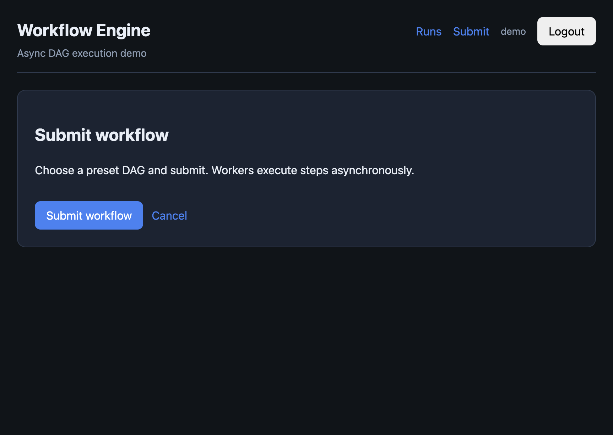
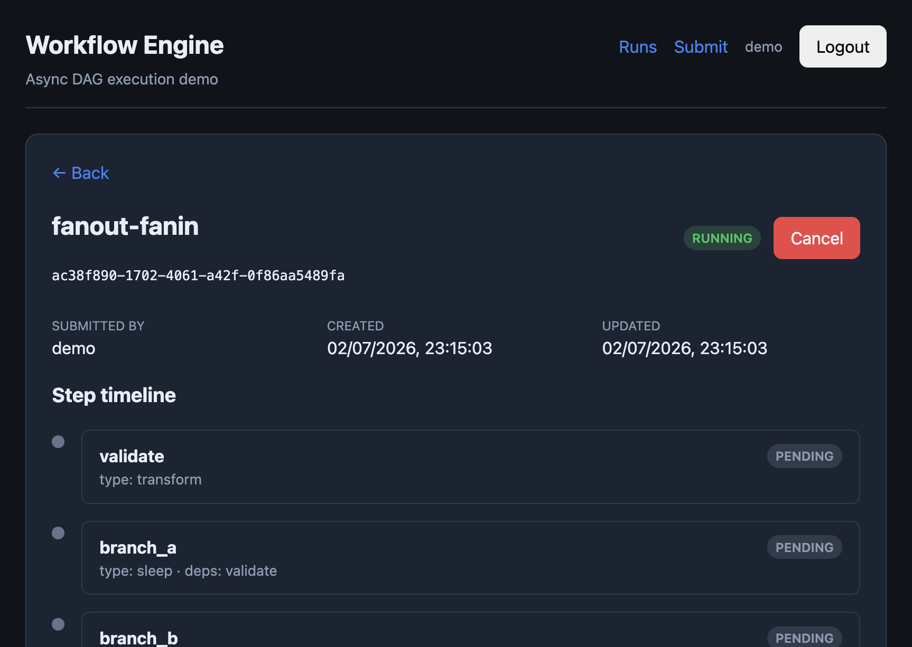
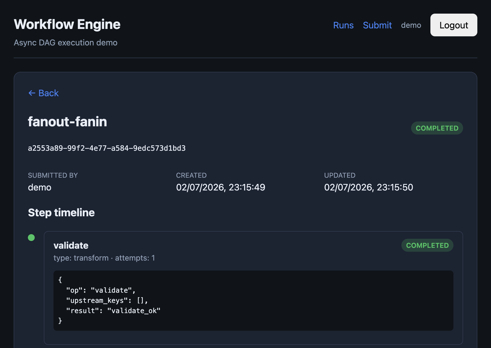
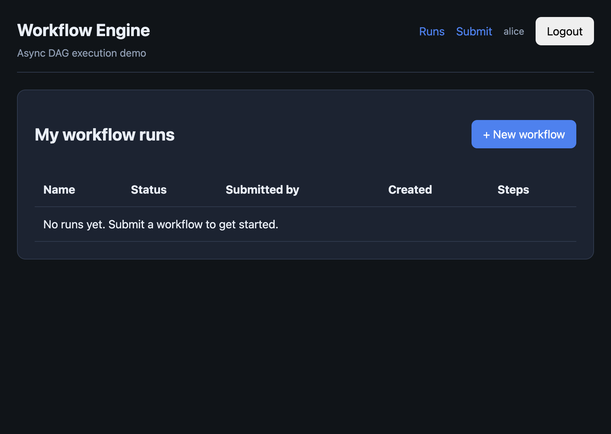

# Workflow Engine

Async DAG workflow engine — distributed step execution, multi-user JWT auth, React UI, Prometheus/Grafana/Jaeger observability.

**Design doc (interview write-up):** [docs/DESIGN.md](docs/DESIGN.md)

## Quick start

```bash
make up
make seed-multi-user
make verify-e2e
```

Ports in `.env.ports`:

| Service | URL |
|---------|-----|
| UI | http://localhost:18780 |
| API | http://localhost:18700/docs |
| Grafana | http://localhost:18701 |
| Prometheus | http://localhost:18790 |
| Jaeger | http://localhost:18786 |

**Users:** `demo`/`demo`, `alice`/`alice`, `bob`/`bob`

## E2E screenshots

Browser-automation captures from the local stack (`docs/e2e-screenshots/`). They show multi-user auth and the submit → complete flow.

| # | Screenshot | What it shows |
|---|------------|---------------|
| 1 | [01-dashboard-demo.png](docs/e2e-screenshots/01-dashboard-demo.png) | `demo` logged in — only demo's completed runs |
| 2 | [02-submit-fanout.png](docs/e2e-screenshots/02-submit-fanout.png) | Submit page with **fanout-fanin** preset selected |
| 3 | [03-run-completed-fanout.png](docs/e2e-screenshots/03-run-completed-fanout.png) | Run detail — all steps **COMPLETED**, step timeline |
| 4 | [04-dashboard-alice-empty.png](docs/e2e-screenshots/04-dashboard-alice-empty.png) | After logout → `alice` login — empty dashboard (no demo runs) |

### UI walkthrough

**Demo user dashboard** — submitted runs visible only to `demo`:



**Submit fanout workflow:**



**Completed run with step timeline:**



**Alice sees no other user's workflows:**



## Commands

```bash
make up              # docker compose stack
make seed-multi-user # sample workflows per user
make verify-e2e      # end-to-end checks
make test            # pytest
make demo            # CLI walkthrough
make loadtest        # k6 (100 VUs, 30s)
```

## Kubernetes (kind)

```bash
make kind-up && make deploy
kubectl scale deployment workflow-worker -n workflow-system --replicas=4
```

## Docs

| Doc | Contents |
|-----|----------|
| [DESIGN.md](docs/DESIGN.md) | Design, observability, **load testing (k6)**, scaling, saturation |
| [ARCHITECTURE.md](docs/ARCHITECTURE.md) | Components and state machine |
| [OBSERVABILITY.md](docs/OBSERVABILITY.md) | Metrics, traces, Grafana |
| [SCALING.md](docs/SCALING.md) | Load test procedure |

## Layout

```
backend/     FastAPI API + async worker
frontend/    React UI
observability/  Prometheus, Grafana, OTel configs
k8s/         kind manifests
scripts/     deploy, verify-e2e, seed-multi-user
loadtest/    k6
docs/        design, architecture, e2e-screenshots/
```
