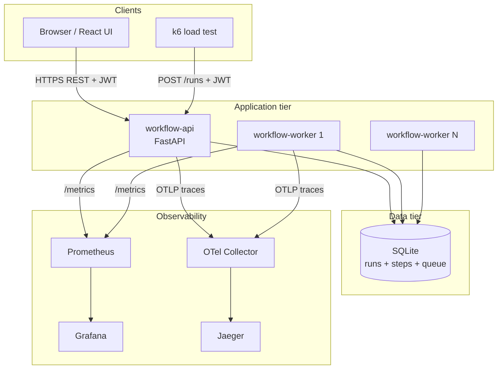
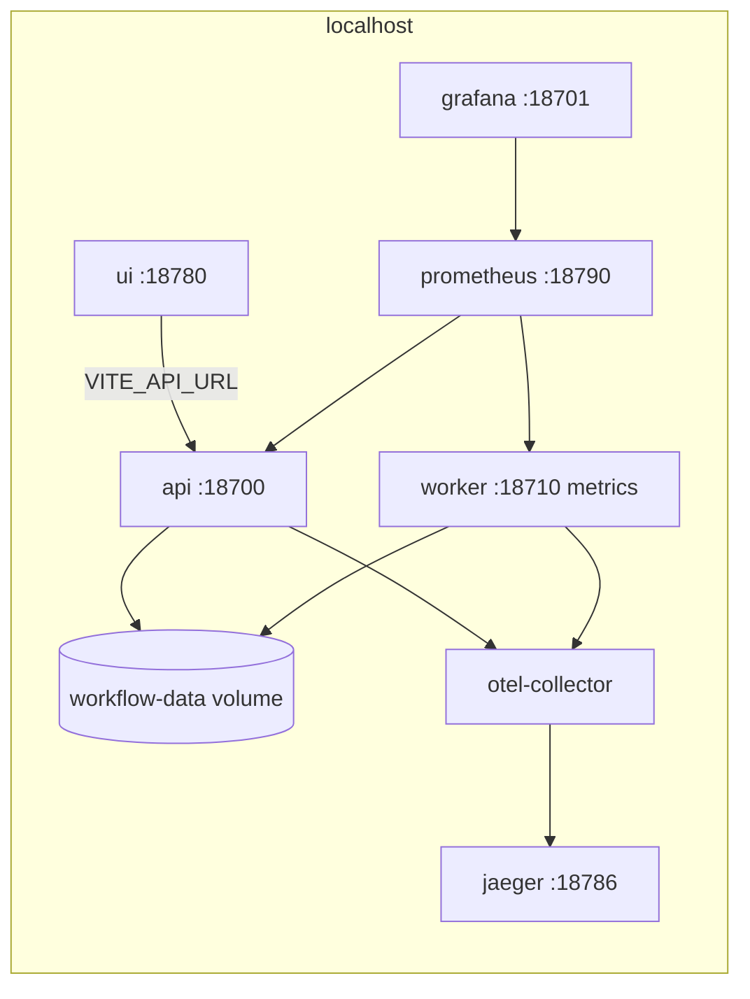
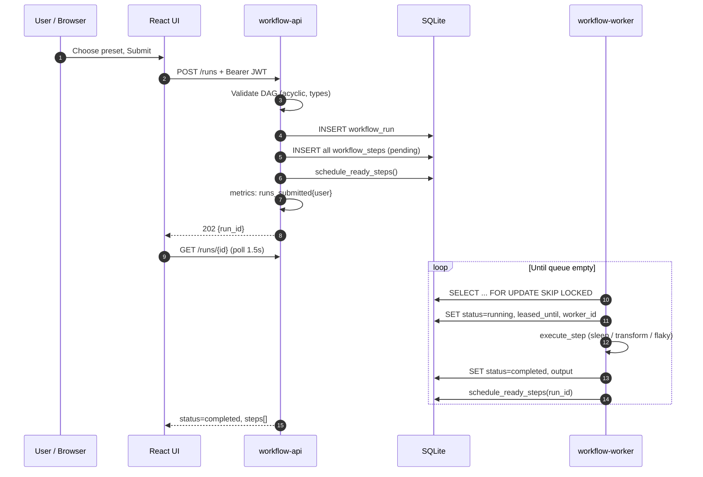
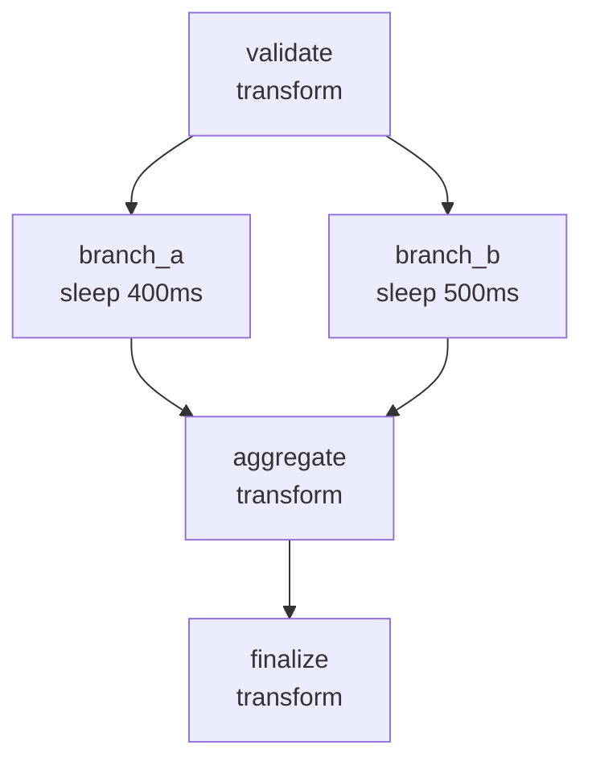
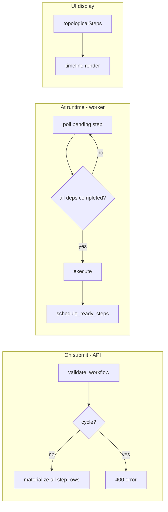
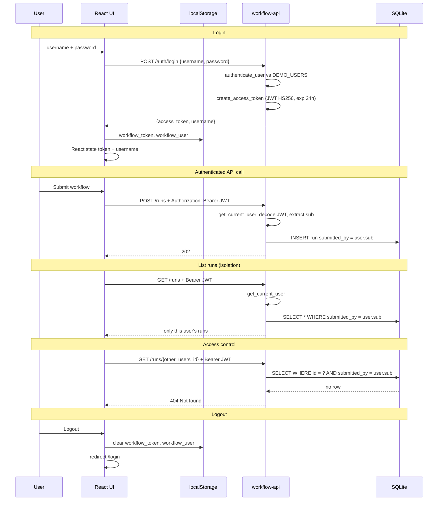
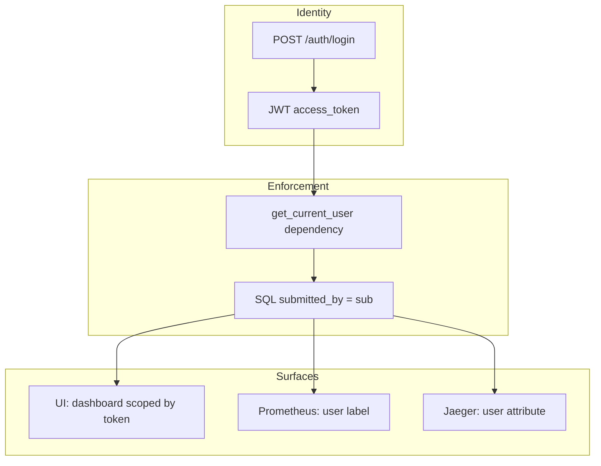
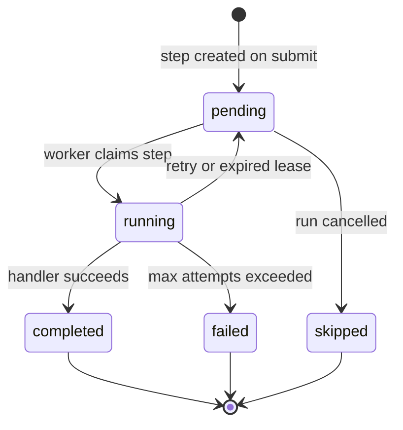
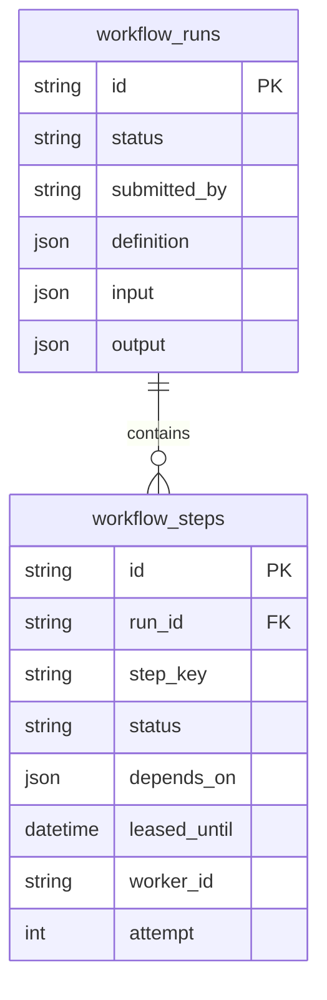

# Architecture

Deep-dive on components, diagrams, leasing, DAGs, and auth. For load testing and scaling see [DESIGN.md](DESIGN.md).

---

## System overview

| Component | Role |
|-----------|------|
| **workflow-api** | REST: auth, submit, list, get, cancel. Writes durable state. Stateless. |
| **workflow-worker** | Polls SQLite, claims steps, executes handlers, schedules dependents. |
| **workflow-ui** | React SPA (nginx): login, submit presets, live step timeline. |
| **SQLite** | Single source of truth for runs, steps, and the work queue (WAL mode). |
| **Prometheus + Grafana** | Metrics with per-user labels; provisioned dashboard. |
| **OTel + Jaeger** | Traces for `submit_run` and `execute_step`. |

---

## Docker Compose deployment

---

## End-to-end: submit a workflow

**Key idea:** the API never runs step logic. It only **records** work. Workers **pull** work from the same database.

---

## DAG and topological sort

### What is the DAG here?

A **Directed Acyclic Graph**: steps are nodes, `depends_on` are arrows (“B waits for A”). **No cycles** — you can’t have A depend on B while B depends on A.

**Fanout preset example:**

- **Roots** (no deps): `validate` — runnable immediately after submit.
- **Parallel**: `branch_a` and `branch_b` can run on different workers once `validate` completes.
- **Fan-in**: `aggregate` waits until **both** branches are done.

### Where DAG logic lives (two different jobs)

| Layer | File | What it does |
|-------|------|----------------|
| **Validation** | `backend/app/engine/dag.py` | On submit: duplicate keys, unknown deps, **cycle detection** (DFS), max 10 steps |
| **Scheduling** | `backend/app/engine/scheduler.py` | At runtime: “which `pending` steps have all deps `completed`?” — **not** full topo sort |
| **Display** | `frontend/.../RunDetail.tsx` | **Topological sort** to order the timeline UI top-to-bottom |

### Topological sort — what and why

**Topological sort** = order nodes so every dependency comes **before** its dependents.

- **Backend `topological_order()`** — used in tests/validation; proves the graph is a valid DAG and could order batch execution (we don’t use it to drive the worker; workers use **ready-set** polling instead).
- **Frontend `topologicalSteps()`** — sorts steps for the **timeline UI** so parents appear above children, even if `branch_b` finished before `branch_a`.

**Interview line:** “Topo sort validates and **displays** the DAG; **execution order** comes from dependency checks on each poll, which naturally allows parallel branches.”

### How `schedule_ready_steps` works

1. Load all steps for a `run_id`.
2. Build set of `completed` step keys.
3. For each `pending` step: if every key in `depends_on` is in `completed`, it’s **ready** (worker can claim it).
4. Resolve `input_data` from upstream `output` JSON.
5. If all steps terminal → mark run `completed` and aggregate outputs.

No central “orchestrator” process — the **database rows + scheduler function** are the orchestration.

---

## Authentication end-to-end

### Design choices

- **Stateless API** — no server-side sessions; JWT proves identity on every request.
- **Row-level tenancy** — `workflow_runs.submitted_by` set at submit from JWT `sub`.
- **404 not 403** on other users’ runs — don’t leak that a run ID exists.

### Auth flow diagram

### Step-by-step

1. **Login** — `POST /auth/login` checks `DEMO_USERS` env (`demo:demo,alice:alice,bob:bob`).
2. **Token** — PyJWT signs `{sub, username, exp}` with `JWT_SECRET`.
3. **Storage** — Browser stores token in `localStorage`; `apiFetch` adds `Authorization: Bearer ...` on every call.
4. **Protected routes** — FastAPI `Depends(get_current_user)` on `/runs`, `/presets`, etc.
5. **Submit** — `submitted_by=user.sub` written to DB; metric `workflow_runs_submitted_total{user="..."}` incremented.
6. **Read** — `list_runs` and `get_run` filter `WHERE submitted_by = user.sub`.
7. **Expiry** — API returns 401; UI clears session and shows “log in again”.
8. **Observability** — same `user` on metrics and trace spans; Grafana filters per tenant.

---

## Why separate API and workers?

- Submit returns **202** immediately — API never blocks on step duration.
- Workers scale with `kubectl scale`; API replicas stay light.
- Worker crash doesn’t take down the API.

## Why SQLite-as-queue?

- Zero extra infra for the demo.
- `FOR UPDATE SKIP LOCKED` = safe concurrent consumers.
- **Ceiling:** single-writer lock (~4–6 workers). Production: SQS + Postgres — [DESIGN.md](DESIGN.md).

## State machines

**Run:** `pending` → `running` → `completed` | `failed` | `cancelled`

**Step:** `pending` → `running` → `completed` | `failed` | `skipped` | `cancelled`

`flaky` steps: `running` → `pending` (retry with `next_attempt_at`) up to 5 attempts.

Workers claim steps with `FOR UPDATE SKIP LOCKED`, set `leased_until` and `worker_id`, and a background reaper resets expired `running` rows to `pending`.

---

## Data model (simplified)

---

## Related docs

| Doc | Topics |
|-----|--------|
| [DESIGN.md](DESIGN.md) | Interview write-up, load testing, saturation |
| [OBSERVABILITY.md](OBSERVABILITY.md) | PromQL, Grafana, Jaeger |
| [SCALING.md](SCALING.md) | k6 worker sweep |
