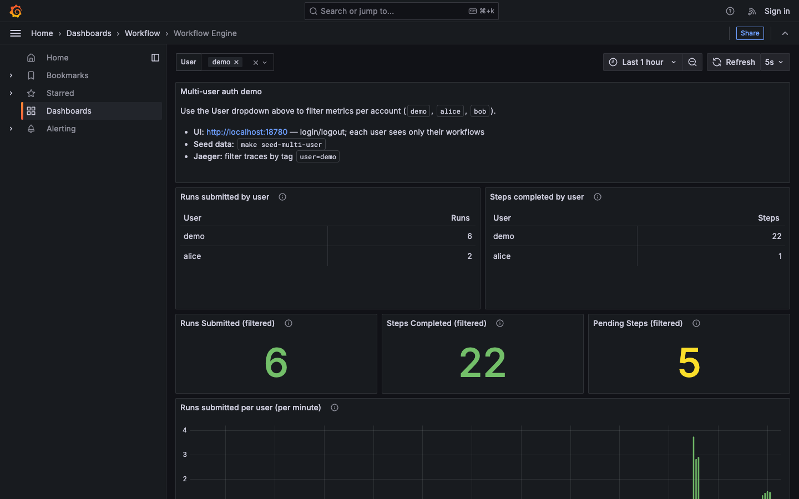
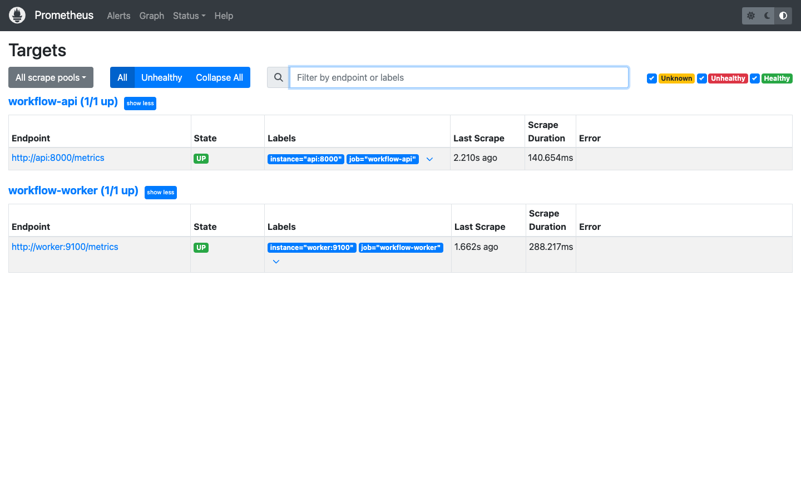

# Observability

## Signals

| Signal | Tool | Correlation |
|---|---|---|
| Metrics | Prometheus → Grafana | `user`, `step_type`, `status` labels |
| Traces | OTel → Jaeger | `user`, `run_id`, `step_key` span attributes |
| Logs | structlog JSON (stdout) | `run_id`, `step_key`, `user` fields |

## Screenshots

From `docs/e2e-screenshots/` after `make up` and submitting workflows:

| Screenshot | What it shows |
|------------|---------------|
| [05-grafana-dashboard-demo.png](e2e-screenshots/05-grafana-dashboard-demo.png) | Per-user Grafana dashboard (`demo`) |
| [06-prometheus-targets.png](e2e-screenshots/06-prometheus-targets.png) | Scrape targets for API + worker |
| [07-prometheus-workflow-metrics.png](e2e-screenshots/07-prometheus-workflow-metrics.png) | `workflow_runs_submitted_total` in Prometheus |





Re-capture: `./scripts/capture-obs-screenshots.sh`

## Demo walkthrough

1. `make seed-multi-user` — populate metrics for demo, alice, bob
2. Open Grafana → **User** filter → per-user tables and charts
3. Submit workflow from UI → watch `workflow_runs_submitted_total{user="..."}` increase
4. Jaeger → service `workflow-api` or `workflow-worker` → filter by `user` tag

## URLs (default ports in `.env.ports`)

- Grafana: http://localhost:18701/d/workflow-engine/workflow-engine
- Prometheus: http://localhost:18790
- Jaeger: http://localhost:18786

## Alerts (suggested)

```promql
workflow_pending_steps > 50   # worker saturation
histogram_quantile(0.95, rate(workflow_worker_poll_latency_seconds_bucket[5m])) > 1  # DB contention
```

Full queries and scaling notes: [DESIGN.md](DESIGN.md)
